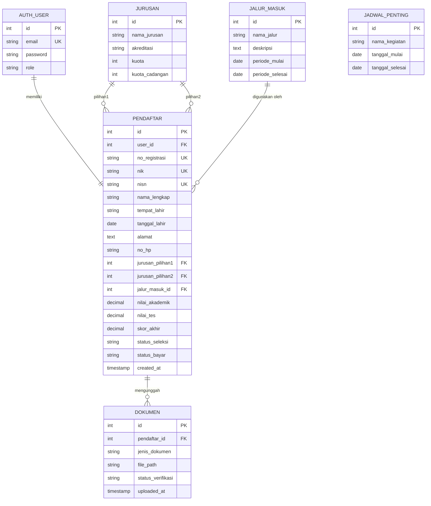
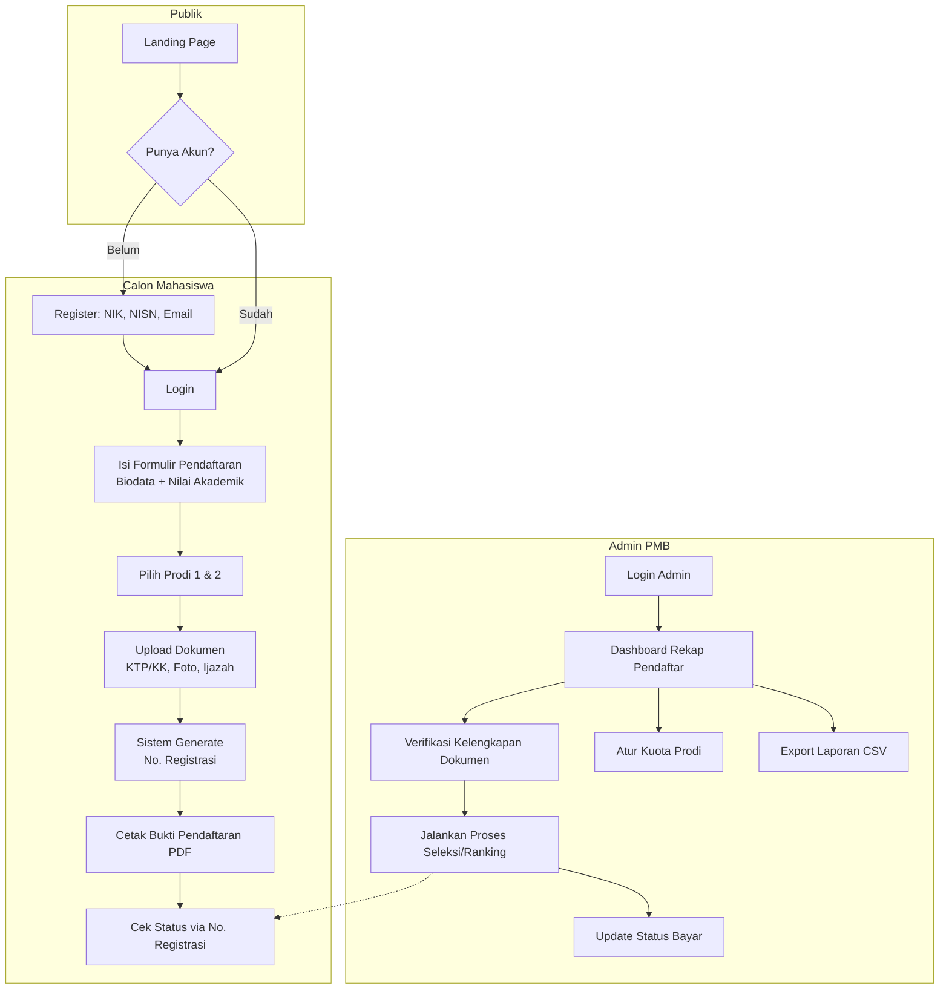
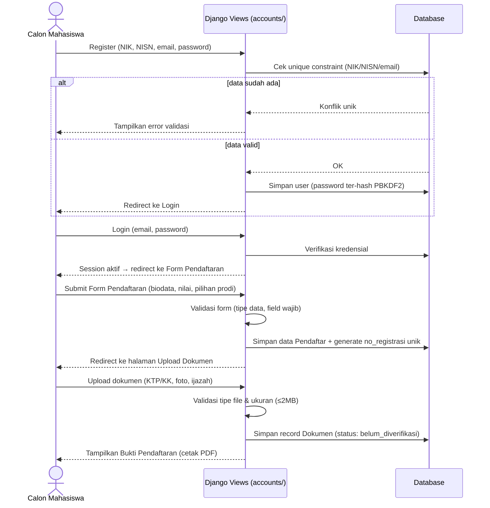
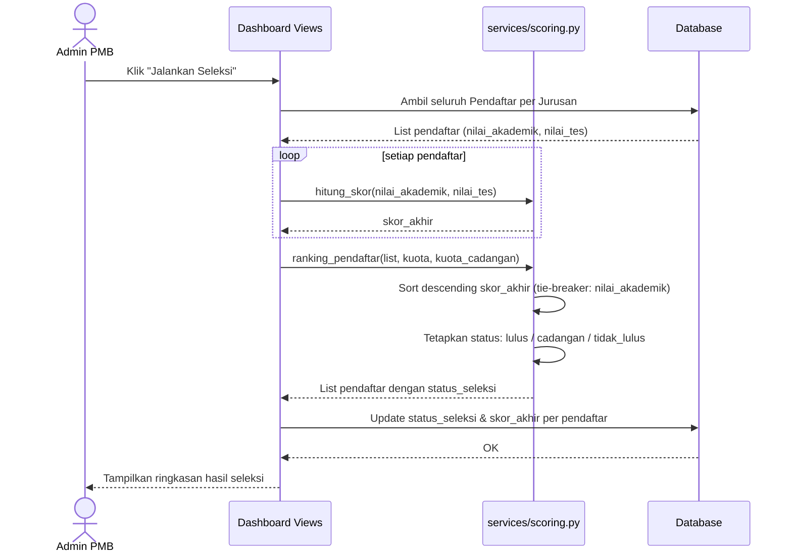
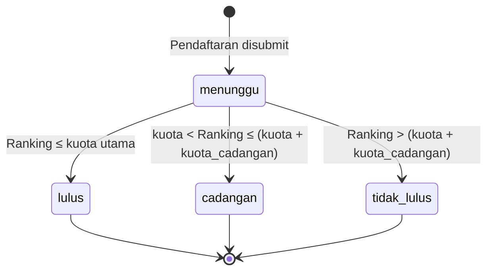
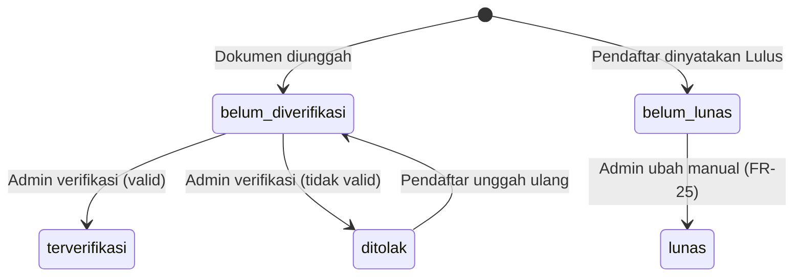

# Database Schema & Application Flow
# Sistem Informasi Penerimaan Mahasiswa Baru (PMB)
### Universitas Nusantara Jaya (Studi Kasus Fiktif)

| | |
|---|---|
| **Versi Dokumen** | 1.0 |
| **Tanggal** | 3 Juli 2026 |
| **Disusun oleh** | Analis Program |
| **Dokumen Acuan** | PRD_Sistem_Informasi_PMB.md, TRD_Sistem_Informasi_PMB.md |
| **Status** | Final untuk Asesmen |

---

## 1. Database Schema

### 1.1 Entity Relationship Diagram (ERD)

> Catatan: `AUTH_USER` merupakan tabel bawaan Django Auth (`auth_user`), tidak dibuat ulang secara manual — hanya diperluas melalui field `role` (via model `Profile`/`OneToOneField` sesuai app `accounts/`).

### 1.2 Detail Tabel

#### a. `jurusan`

| Kolom | Tipe | Constraint | Keterangan |
|---|---|---|---|
| id | INTEGER | PK, AUTOINCREMENT | |
| nama_jurusan | VARCHAR(100) | NOT NULL | |
| akreditasi | VARCHAR(5) | | contoh: A, B, Unggul |
| kuota | INTEGER | NOT NULL, DEFAULT 0 | kuota utama (Lulus) |
| kuota_cadangan | INTEGER | NOT NULL, DEFAULT 0 | kuota tambahan (Cadangan) |

#### b. `jalur_masuk`

| Kolom | Tipe | Constraint | Keterangan |
|---|---|---|---|
| id | INTEGER | PK, AUTOINCREMENT | |
| nama_jalur | VARCHAR(50) | NOT NULL | Reguler / Prestasi / KIP-K / Kerjasama |
| deskripsi | TEXT | | |
| periode_mulai | DATE | | |
| periode_selesai | DATE | | |

#### c. `pendaftar`

| Kolom | Tipe | Constraint | Keterangan |
|---|---|---|---|
| id | INTEGER | PK, AUTOINCREMENT | |
| user_id | INTEGER | FK → auth_user(id), UNIQUE, NOT NULL | relasi 1—1 dengan akun login |
| no_registrasi | VARCHAR(20) | UNIQUE, NOT NULL | digenerate otomatis saat submit (FR-15) |
| nik | VARCHAR(16) | UNIQUE, NOT NULL | |
| nisn | VARCHAR(10) | UNIQUE, NOT NULL | **INDEX** (idx_pendaftar_nisn) |
| nama_lengkap | VARCHAR(150) | NOT NULL | |
| tempat_lahir | VARCHAR(100) | | |
| tanggal_lahir | DATE | | |
| alamat | TEXT | | |
| no_hp | VARCHAR(15) | | |
| jurusan_pilihan1 | INTEGER | FK → jurusan(id), NOT NULL | **INDEX** (idx_pendaftar_jurusan1) |
| jurusan_pilihan2 | INTEGER | FK → jurusan(id), NULLABLE | |
| jalur_masuk_id | INTEGER | FK → jalur_masuk(id), NOT NULL | |
| nilai_akademik | DECIMAL(5,2) | | skala 0–100 |
| nilai_tes | DECIMAL(5,2) | | skala 0–100 |
| skor_akhir | DECIMAL(5,2) | | hasil `hitung_skor()`, dihitung otomatis |
| status_seleksi | VARCHAR(20) | DEFAULT 'menunggu' | menunggu \| lulus \| cadangan \| tidak_lulus — **INDEX** (idx_pendaftar_status) |
| status_bayar | VARCHAR(15) | DEFAULT 'belum_lunas' | lunas \| belum_lunas |
| created_at | TIMESTAMP | DEFAULT CURRENT_TIMESTAMP | |

#### d. `dokumen`

| Kolom | Tipe | Constraint | Keterangan |
|---|---|---|---|
| id | INTEGER | PK, AUTOINCREMENT | |
| pendaftar_id | INTEGER | FK → pendaftar(id), NOT NULL | |
| jenis_dokumen | VARCHAR(30) | NOT NULL | ktp \| kk \| pas_foto \| ijazah |
| file_path | VARCHAR(255) | NOT NULL | validasi tipe (pdf/jpg/png) & maks. 2MB |
| status_verifikasi | VARCHAR(20) | DEFAULT 'belum_diverifikasi' | belum_diverifikasi \| terverifikasi \| ditolak |
| uploaded_at | TIMESTAMP | DEFAULT CURRENT_TIMESTAMP | |

#### e. `jadwal_penting`

| Kolom | Tipe | Constraint | Keterangan |
|---|---|---|---|
| id | INTEGER | PK, AUTOINCREMENT | |
| nama_kegiatan | VARCHAR(150) | NOT NULL | ditampilkan di landing page (FR-03) |
| tanggal_mulai | DATE | | |
| tanggal_selesai | DATE | | |

### 1.3 Ringkasan Indexing (NFR-01)

| Index | Tabel.Kolom | Tujuan |
|---|---|---|
| idx_pendaftar_nisn | pendaftar.nisn | validasi unik & pencarian cepat saat verifikasi |
| idx_pendaftar_jurusan1 | pendaftar.jurusan_pilihan1 | mempercepat query ranking per jurusan |
| idx_pendaftar_status | pendaftar.status_seleksi | mempercepat filter dashboard admin |

### 1.4 Aturan Integritas Data

- `user_id`, `nik`, `nisn`, `no_registrasi`, `email` (`auth_user.email`) bersifat **UNIQUE** — mencegah duplikasi pendaftar (FR-07).
- `jurusan_pilihan1` wajib diisi, `jurusan_pilihan2` opsional.
- Penghapusan `jurusan` atau `jalur_masuk` yang masih direferensikan `pendaftar` dibatasi (`ON DELETE RESTRICT`) agar riwayat pendaftaran tidak rusak.
- Penghapusan `pendaftar` akan menghapus turunan `dokumen` (`ON DELETE CASCADE`).

---

## 2. Application Flow

### 2.1 Peta Alur Umum per Role

### 2.2 Alur Detail: Registrasi & Pendaftaran (Calon Mahasiswa)

### 2.3 Alur Detail: Proses Seleksi (Admin → Sistem)

### 2.4 State Diagram: `status_seleksi`

### 2.5 State Diagram: `status_verifikasi` (Dokumen) & `status_bayar`

### 2.6 Page Flow — Sisi Publik / Calon Mahasiswa

| Langkah | Halaman/Endpoint | Auth | Aksi |
|---|---|---|---|
| 1 | `GET /` | Publik | Lihat info kampus, jalur masuk, jadwal, biaya, FAQ |
| 2 | `GET/POST /accounts/register/` | Publik | Buat akun (NIK, NISN, email) |
| 3 | `GET/POST /accounts/login/` | Publik | Login |
| 4 | `GET/POST /pendaftaran/form/` | Login | Isi biodata, nilai, pilih prodi |
| 5 | `POST /pendaftaran/upload/` | Login | Upload dokumen |
| 6 | `GET /pendaftaran/bukti/<no_registrasi>/` | Login | Cetak bukti pendaftaran (PDF) |
| 7 | `GET /pendaftaran/hasil/<no_registrasi>/` | Publik (dgn no. reg) | Cek hasil seleksi |
| 8 | `POST /accounts/logout/` | Login | Logout |

### 2.7 Page Flow — Sisi Admin PMB / Super Admin

| Langkah | Halaman/Endpoint | Auth | Aksi |
|---|---|---|---|
| 1 | `GET /dashboard/` | Admin | Rekap statistik pendaftar |
| 2 | `GET /dashboard/pendaftar/` | Admin | List & filter (prodi, status, jalur) |
| 3 | `POST /dashboard/verifikasi/<id>/` | Admin | Verifikasi kelengkapan dokumen |
| 4 | (Kelola kuota prodi via Django Admin / dashboard) | Admin/Super Admin | Atur `kuota` & `kuota_cadangan` |
| 5 | `POST /dashboard/jalankan-seleksi/` | Admin | Trigger `ranking_pendaftar()` |
| 6 | `POST /dashboard/verifikasi/<id>/` (status_bayar) | Admin | Update status pembayaran manual |
| 7 | `GET /dashboard/export/csv/` | Admin | Export laporan CSV |
| — | Manajemen user & konfigurasi jalur masuk | Super Admin | Akses tambahan di luar Admin PMB |

### 2.8 Ringkasan Traceability Flow → FR/NFR

| Bagian Flow | FR/NFR Terkait |
|---|---|
| Registrasi & Login | FR-06 s.d. FR-10, NFR-02 |
| Form Pendaftaran & Upload Dokumen | FR-11 s.d. FR-16, NFR-02 (validasi file) |
| Proses Seleksi & Ranking | FR-17 s.d. FR-21, NFR-05 (unit test 100%) |
| Dashboard Admin & Export | FR-22 s.d. FR-27, NFR-01 (indexing), NFR-03 (performa) |

---

*Dokumen ini disusun berdasarkan `PRD_Sistem_Informasi_PMB.md` dan `TRD_Sistem_Informasi_PMB.md` sebagai referensi implementasi database dan alur aplikasi.*
